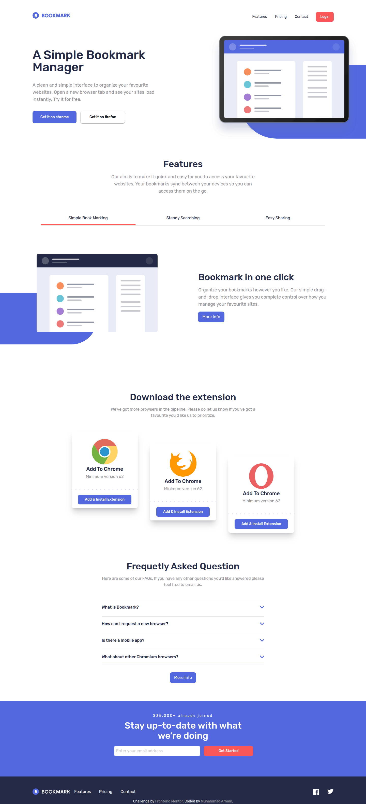

# Frontend Mentor - Bookmark landing page solution

This is a solution to the [Bookmark landing page challenge on Frontend Mentor](https://www.frontendmentor.io/challenges/bookmark-landing-page-5d0b588a9edda32581d29158). Frontend Mentor challenges help you improve your coding skills by building realistic projects. 

## Table of contents

- [Overview](#overview)
  - [The challenge](#the-challenge)
  - [Screenshot](#screenshot)
  - [Links](#links)
- [My process](#my-process)
  - [Built with](#built-with)
  - [What I learned](#what-i-learned)
- [Author](#author)


## Overview

### The challenge

Users should be able to:

- View the optimal layout for the site depending on their device's screen size
- See hover states for all interactive elements on the page
- Receive an error message when the newsletter form is submitted if:
  - The input field is empty
  - The email address is not formatted correctly

### Screenshot



### Links

- Solution URL: [Add solution URL here](https://github.com/fa23bcs233/bookmark-landing-page)
- Live Site URL: [Add live site URL here](https://fa23bcs233.github.io/bookmark-landing-page)

## My process

### Built with

- Semantic HTML5 markup
- CSS custom properties
- Flexbox
- CSS Grid
- Mobile-first workflow
- Tailwind CSS


### What I learned

This was my first site build with the tailwind CSS. I learned to work with the tailwind CSS classes and breakpoints. Also learned how to handle the active states with the tailwind.Learned to manage the themes in the tailwind which helped me customize the tailwind default colors.Also I focused on accessibility in this particular project I handled the aria-hidden with reponsive UI.

To see how you can add code snippets, see below:

```css
@theme{
    --color-blue-600: hsl(231, 69%, 60%);
    --color-red-400: hsl(0, 94%, 66%);
    --color-grey-50: hsl(252deg 2.37% 58.63%);
    --color-blue-950: hsl(229, 31%, 21%);
    --font-rubik: "Rubik", sans-serif;
}
```
```js

const ResponsiveAccessibility = (function(){
    const mediumScreen = window.matchMedia("(min-width: 768px)");

    function handleMediumScreenChange(e){
        if (e.matches) {
            DOM.menuToggleButton.setAttribute("aria-hidden", "true");
            DOM.menu.setAttribute("aria-hidden", "false");
            DOM.tabPannelsButtons.forEach(button => {
                button.setAttribute("aria-hidden", "false");
            });
        }else{
            DOM.menuToggleButton.setAttribute("aria-hidden", "false");
            DOM.menu.setAttribute("aria-hidden", "true");
            DOM.tabPannelsButtons.forEach(button => {
                button.setAttribute("aria-hidden", "true");
            });
        }
    }

    handleMediumScreenChange(mediumScreen);
    mediumScreen.addEventListener("change", handleMediumScreenChange);
})();
```

## Author

- Website - [Muhammad Arham](https://fa23bcs233.github.io/portfolio)
- Frontend Mentor - [@fa23bcs233](https://www.frontendmentor.io/profile/fa23bcs233)
- Linked IN - [Muhammad Arham](https://www.linkedin.com/in/arham-rafiq-a599a22b1/)
- Twitter - [@arhamrafiq831](https://x.com/arhamrafiq831)

